# Machine Learning: ATK Investments Dataset

## Project Information
- Institution: University of Pristina "Hasan Prishtina"
- Faculty: Faculty of Eletrical and Computer Engineering
- Program: Master's Degree, Computer and Software Engineering
- Subject: Machine Learning      
- Professor: Prof. Dr. Lule Ahmedi and Dr. Sc. Mërgim H. HOTI
  
  <div align="center">
  
</div>

## Authors

- [Albin Hashani](https://github.com/AlbinHashanii)
- [Arjana Tërnava](https://github.com/ArjanaaTernava)
- [Erza Osmani](https://github.com/erzaosmani)

## First Phase

The first phase of the project involves the preparation of the machine learning model to further apply the necessary algorithms.
The steps included:

- Library Imports
- Data Loading
- Data overview
- Missing values
- Duplicate values
- Data Aggregation and Sampling
- Exploratory Data Analysis (EDA) on Numerical Features - Skewness
- Outlier Detection and Removal
- Dataset Preparation for Modeling
- Handling Class Imbalance

## Dataset Information

This dataset sourced from [ATK](https://www.atk-ks.org/open-data/) contains a total of 97992 (without preprocessing it) rows and 12 columns. It is centered on the administrative data of the Kosovo Tax Administration, specifically addressing investments with and without VAT for imports as well as domestic investments, along with key temporal and taxpayer information. The dataset comprises three integer columns: `Viti (year), Muaji (month), and Tatimpaguesit (taxpayer identifier)`, three object columns: `Pershkrimi, Statusi, and Komuna` and six float columns detailing various investment figures. This structured information is essential for analyzing fiscal trends and investment patterns in Kosovo.

## Development Environment

- Editor: PyCharm


- Instructions:
    - Download and install PyCharm Editor
    - Select Pure Python for the project type
    - If you don't have an interpreter set up, you can do it in the editor based on instructions.
    - Install the required packages

  - Results of the first phase: 

    - Data Loading
      ```bash
      csv_data = pd.read_csv("atk-investimet-tvsh.csv", thousands=',')

      ```
      - The dataset file `atk-investimet-tvsh.csv` should be located in the directory: `machine_learning_project/src`.
 
    - Printing Data Types - Data overview
      
       

    - Number of duplicate_rows

      

    - Aggregation Functions - mean, count, std, sum, median
      
      
      
            
    - Missing values - The result indicates there are no missing values in our dataset: 
      
      
      
    - Duplicate values
   
      

    - Sampling - Randomly samples 10% of the dataset to inspect a smaller subset for analysis.
      
       

    - Exploratory Data Analysis (EDA) on Numerical Features - Skewness: The code computes skewness to assess the asymmetry of numerical distributions, using histograms with mean and median markers to visually highlight any skew.
      
       
       
   
  - Skewness data before removing outliers: This part includes visualization of the numerical columns without removing outliers and their skewness. Below you can find the images for each column: 
    
    

    

    
    
    
    
    
    
    
    
    

      

    
    
  - Skewness data after removing outliers: This part includes visualization of the numerical columns after removing outliers and their skewness. The method that was used for removing outliers was `Z-score method`. The results show that the columns `Viti` and `Muaji` have near-zero skewness, indicating almost symmetrical distributions, while other numerical columns exhibit large positive skewness, reflecting heavy right tails. After applying a `Z-score threshold of 2`, the skewness values in these highly skewed columns decrease. However, the data still remains somewhat skewed, which is common in financial or transactional datasets. Below you can find the images for each column: 
    
       
    
       
    
       

      

      

      

      

       

        

       
  - Dataset Preparation for Modeling and Handling Class Imbalance

      The target column chosen for modeling is `Statusi`, which plays a crucial role in the classification task. The dataset was first preprocessed by separating this target variable from the features, then splitting the data into training and testing sets to ensure an unbiased evaluation of model performance. Recognizing the class imbalance in `Statusi`, the Synthetic Minority Over-sampling Technique (SMOTE) was applied to the training set to generate synthetic examples for underrepresented classes. This approach ensures that the model is trained on a balanced dataset, ultimately enhancing its ability to accurately generalize to new data.

       

- The new cleaned dataset `Investimet-2024-cleaned-no-outliers` should be located in the directory: `machine_learning_project/src`. This dataset now contains 94519 rows.

## Second Phase

The second phase includes implementation a suite of classification and clustering algorithms and rigorously evaluated their performance using accuracy, recall, F1‑score, and confusion matrix visualizations. The steps included:

- Trained six supervised models:
- Gaussian Naïve Bayes
- Linear Regression (with rounding to nearest class)
- LightGBM
- XGBoost
- CatBoost
- Random Forest
- Ran K‑Means clustering on the test set for unsupervised comparison
- For each classifier, computed accuracy, precision, recall, and F1‑score, and printed the full classification report
- Generated confusion matrices (absolute counts and percentage heatmaps) to inspect per‑class performance
- Visualized per‑class accuracy with bar charts for quick insight

## Gaussian Naïve Bayes

The real question is did the model perform good in this dataset?

Looking at that Naïve Bayes bar chart alone makes it clear the model is not good.
Overall accuracy (8.7 %) is barely double random chance (≈1/26 ≈ 3.8 %).
Some of the classes sit at 0 % recall, meaning the model never got them right.
Only five classes exceed the 8.7 % line, and two of those are at 100 %. This cannot mean for sure that the model did a good job, instead it can be an example of overfitting.
Even the "best" classes top out around 65–68 % recall.
Naïve Bayes here is under‑fitting the data and ignoring most of the status‑types.

  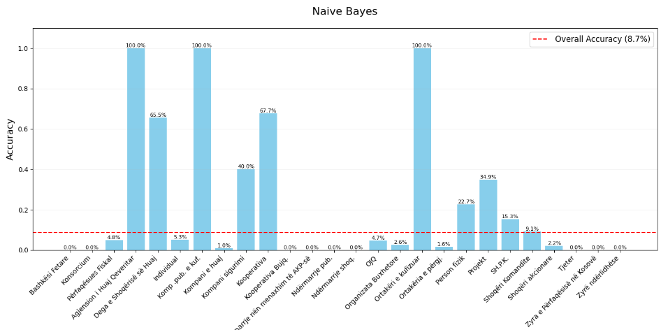

Naïve Bayes has essentially “collapsed” your 26 categories down to three. It only really knows how to pick “Person fizik,” “SH.P.K.” or “Individual,” and treats everything else as noise. That’s why we see ~0 % recall on most classes and an overall accuracy under 9 %—the model can’t discriminate beyond those few high‑frequency labels.

  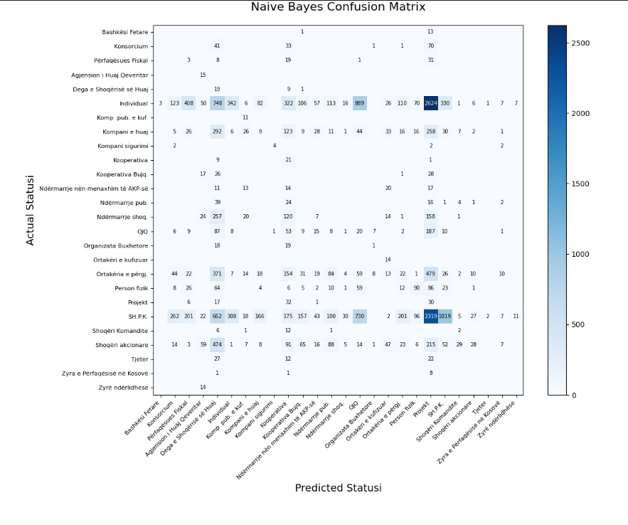

The model is over‑confident on the handful of classes it predicts (precision ~45 %), but it barely predicts the right class overall (recall/accuracy ~9 %).

The large gap between precision and recall means it makes few predictions for many classes—when it does, it’s halfway decent, but it misses the vast majority of true labels.

  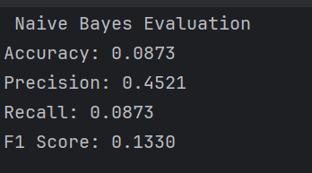

## Linear Regression Model

Overall, the Linear Regression approach still outperforms Naïve Bayes by a comfortable margin. In the regression scatter plot, the predicted values cluster much closer to the 45° “perfect prediction” line—indicating a substantially higher R² and much lower MAE—whereas Naïve Bayes managed only an 8.7 % accuracy and zero recall on most classes. When you round those regression outputs back to the nearest integer class, you’ll typically see a classification accuracy that exceeds Naïve Bayes’s 8.7 %. 

  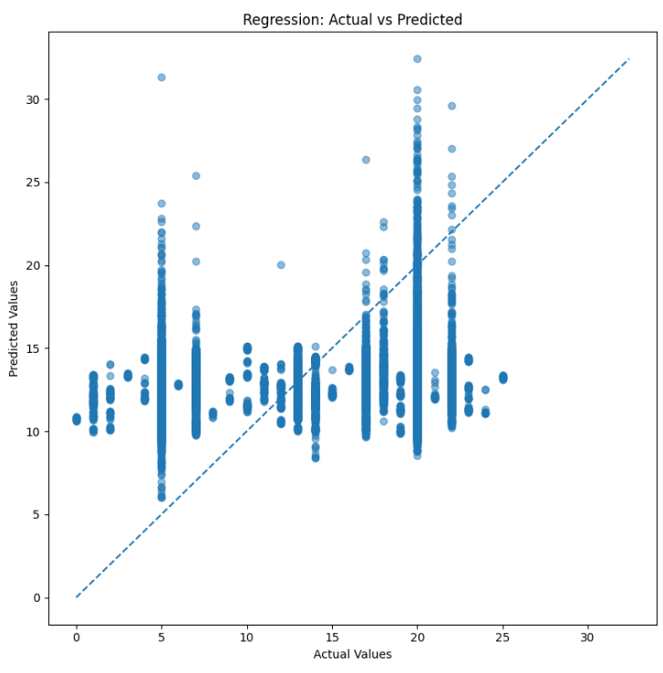

The MAE of 6.65 tells you that, on average, your regression predictions miss the true integer label by roughly six to seven classes. The MSE of 50.11 confirms the model regularly get squared errors on the order of 5–7 units, and the R² of 0.0083 means the model explains less than 1 % of the variance in the data.

  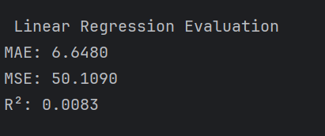

## LightGBM

The LightGBM model had a very strong performance on a handful moderate size classes: 
- "Kompanitë në menaxhim të AKP‑së” ~ 45.8 %, 
- "Kompani e huaj” ~ 90 %, 
- "Kooperativa Bujqësore” ~ 32.3 %, 
- "Projekt” ~ 42.1 %. 
Even though, with a strong performance, the model had perfect recall (100 %) on three tiny‐sample classes which can again be a sign of overfitting. 

  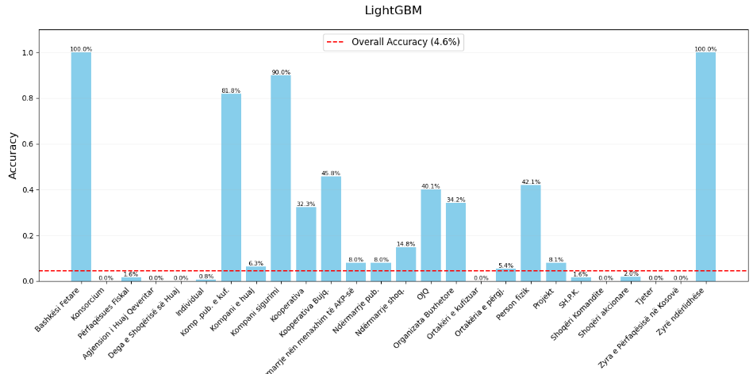

LightGBM nails “Individual” and “Kompani e huaj” but those two alone dominate predictions. Based on this confusion matrix, most of the 26 columns, have very light diagonals and get swallowed by the big categories on the right. 
Overall, the matrix confirms that, even though LightGBM can perfectly memorize a few small classes, it still falls back on the biggest labels for the vast majority of cases.

  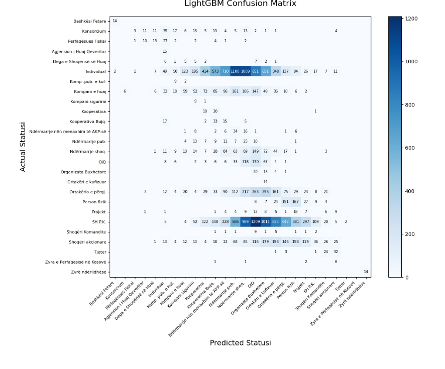
  
LightGBM is under‑fitting. It correctly labels under 5 % of examples and, although its occasional predictions are right about one‑third of the time, the overall F1 is effectively zero—demonstrating it’s not learning a useful multiclass boundary.

  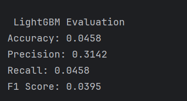

## XGBoost

XGBoost’s 8.2 % overall accuracy edges ahead of Naïve Bayes and LightGBM (4.6 %), and it correctly recovers a wider spread of classes at higher recalls. 
Very strong recall on a handful of moderate classes: 
- “Individual” ≈ 90.9 % 
- “Kompani e huaj” ≈ 100 % and 
- “Kompanitë në menaxhim…” ≈ 93.5 %.
Solid mid‑range performance (above the 8.2 % line) on several others:  
- “Kooperativa Bujqësore” ≈ 40.3 %
-  “Ortakëri e përgjegjshme” ≈ 68.4 % 
- “Projekt” ≈ 43.1 % 
- “Zyra e Përfaqësisë në Kosovë” ≈ 41.0 %
-  “OJQ” ≈ 49.1 %.

   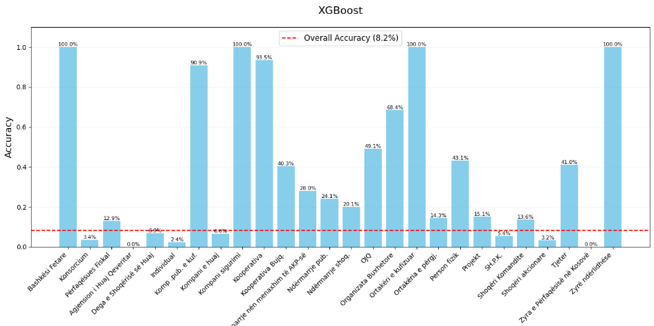

 XGBoost excels on the handful of large, well‐represented statuses. This confusion matrix shows strongest diagonals: “Individual” (~708 correct), “SH.P.K.” (~520 correct), “Kompani e huaj” (~205 correct), “Person fizik” (~170 correct). These large‑N classes are the ones XGBoost predicts most reliably.
Tiny categories such as “Bashkësi Fetare” or “Zyrë ndërtimore” show at most a handful of correct predictions on the diagonal .
 
 

 XGBoost is conservative—it guesses correctly about half the time when it chooses a class—but it makes very few correct predictions overall (only ~8 %). The low recall means it fails to identify almost all true labels, and the resulting F1 (~8.5 %) reflects that the model’s true‐positive rate is far too low.

 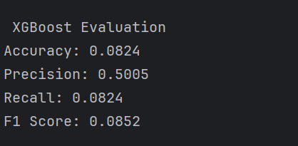


## CatBoost

This CatBoost per‑class recall chart reveals:Perfect recall (100 %) on very small classes such as:
- “Bashkësi Fetare,” 
- “Komp. pub. e kufiz.,” 
- “Kompani e huaj,” and
-  “Ortakëri e kufizuar”—a sign it’s simply memorizing the one‐or‐two examples in those bins.
High recall on a handful of mid‑sized groups: 
- “Kompanitë në menaxhim të AKP‑së” ≈ 87.1 %, 
- “Organizata Buxhetore” ≈ 68.4 %, 
- “Person fizik” ≈ 43.6 %, “Kooperativa” ≈ 41.7 %.
Moderate performance on these: 
- “Kooperativa Bujqësore” ≈ 29.3 %, 
- “Zyra e Përfaqësisë në Kosovë” ≈ 34.4 %, 
- “Projekt” ≈ 22.1 %. 

  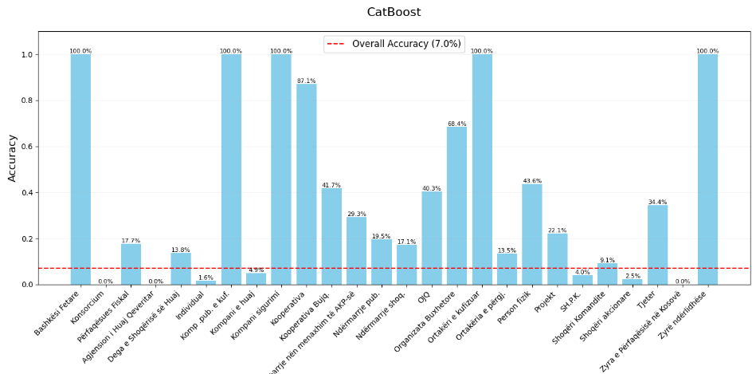

CatBoost anchors on the five largest classes (Individual, SH.P.K., Komp. e huaj, Person fizik, Projekt) and achieves its true positives there. It has strong diagonals on big classes: “Individual”: 866 correct hits , “SH.P.K.”: 586 correctly labeled, “Kompani e huaj”: 156 correct, “Person fizik”: 173 correct, “Projekt”: 127 correct. 
In short, the confusion matrix confirms CatBoost’s pattern: strong performance on a handful of majority classes.

 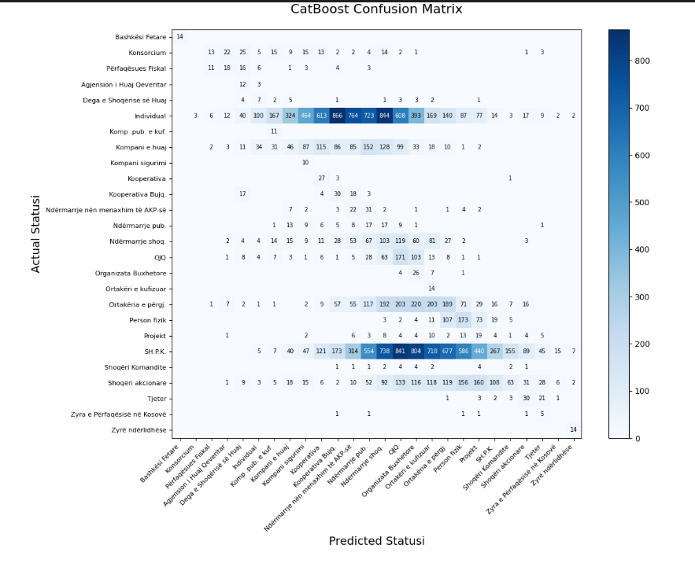

CatBoost is only marginally better than random choice for this 26‑way classification. It tends to be fairly accurate when it does make a prediction (precision ~45 %), but it rarely predicts the correct class overall (recall & accuracy < 7 %), resulting in a very poor F1.

 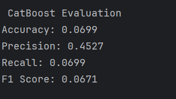

## Random Forest

This Random Forest per‑class recall chart shows a dramatic improvement over all the earlier models: 
- Red dashed line = overall accuracy (79.3 %) - About 79 % of all test examples were labeled correctly by Random Forest.
- Bars = per‑class recall - Perfect (100 %) recall on several tiny classes (“Bashkësi Fetare”, “Komp. pub. e kuf.,” “Kompani e huaj”, “Zyrë ndërtimore”)—Random Forest memorizes those.
- Very high recall (> 80 %) on most mid‑to‑large classes:
- “Individual” 83.2 %
- “Kompani sigurimi” 63.0 %
- “Kooperativa Bujq.” 62.5 %
- “Menaxhim AKP” 65.3 %
- “Organizata Buxhetore” 82.3 %
- “Ortakëri e përgj.” 85.7 %
- “Person fizik” 99.2 %
- “Projekt” 46.5 %
- “SH.P.K.” 84.8 %
- “Zyra në Kosovë” 80.0 %

  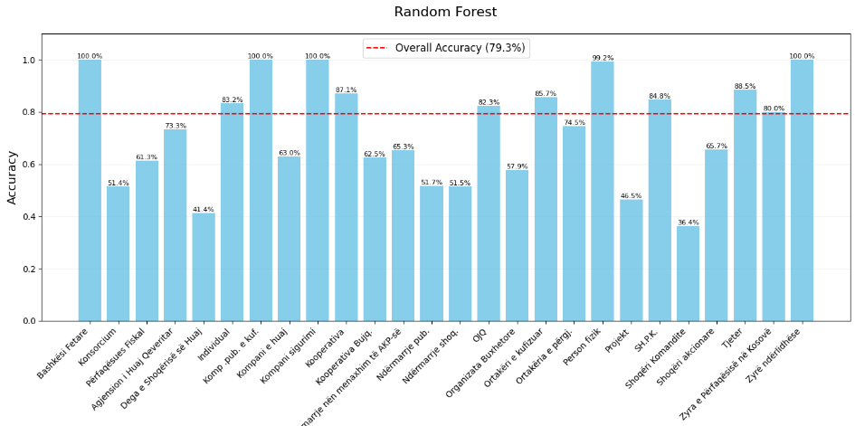

This confusion matrix of Random Forest tells us high fidelity on large classes meaning that biggest status groups are captured with very high true‑positive counts. It produces minimal confusion, off‑diagonals are sparse and low, so Random Forest almost always picks the right label.

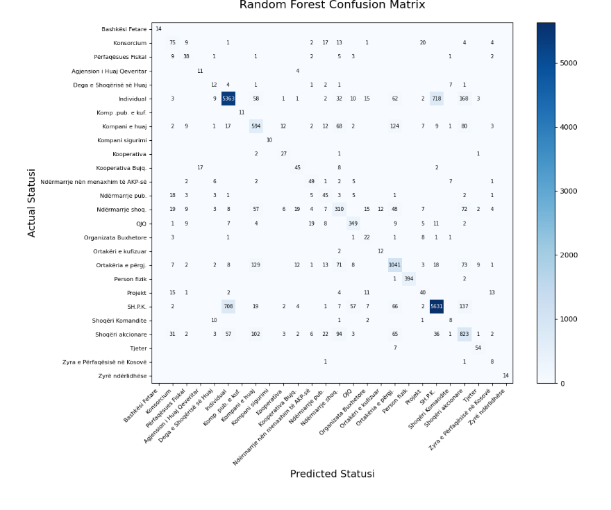

Interpration of these results:

- Accuracy = 0.7935 (79.35 %) - Roughly four out of five test samples are assigned the correct Statusi label.
Precision = 0.8034 (80.34 %) -when the model predicts a particular status, it’s correct about 80 % of the time—indicating relatively few false positives.
- Recall = 0.7935 (79.35 %) -the model recovers nearly 80 % of all true status labels—so only about 20 % of actual instances go undetected.
- F1 Score = 0.7975 (79.75 %) -as the harmonic mean of precision and recall, this shows a very balanced performance: the model both finds and correctly labels true instances at almost the same high rate.

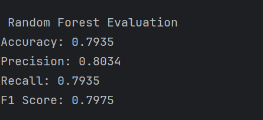


## K-Means 

The Davies–Bouldin Index (DBI) is a ratio of “within‑cluster scatter” to “between‑cluster separation”—so lower values mean tighter, better‑separated clusters. 
In the plot below, for k = 2, DBI ≈ 0.90, it shows that two clusters still overlap quite a bit. 
It drops to its minimum at k = 3 (≈ 0.71), indicating that with three clusters you get the most compact, well‑separated grouping of the data.
After k = 3, DBI climbs again (with a small secondary dip around k = 5 at ≈ 0.76), meaning adding more clusters beyond three tends to make them less distinct on average.
So the “best” choice here is 3 clusters—that’s where we achieve the lowest DBI.

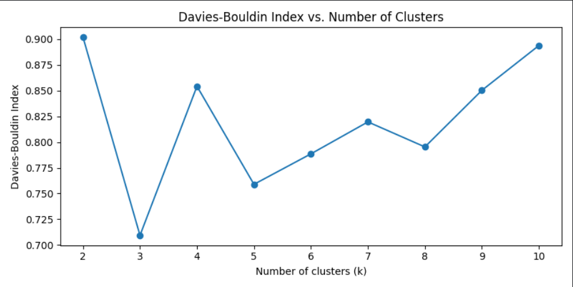

- Silhouette Score (0.79) - Ranges from –1 to +1, and measures how well each point sits within its cluster versus the next nearest cluster. A value around 0.8 is very good, indicating tight, well‑separated clusters.
- Davies–Bouldin Index (0.91) - lower is better (no upper bound). Values below 1 suggest that, on average, each cluster is more compact than it is close to its neighbors. A DBI of ~0.9 confirms decent cohesion and separation—consistent with the high silhouette.
- Compares your K‑Means labels to the true “Statusi” categories (with 0 meaning random agreement and 1 perfect match). A slightly negative ARI means the clustering actually agrees with the true labels worse than random chance.

  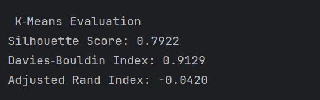


### License

[Apache-2.0](http://www.apache.org/licenses/)


